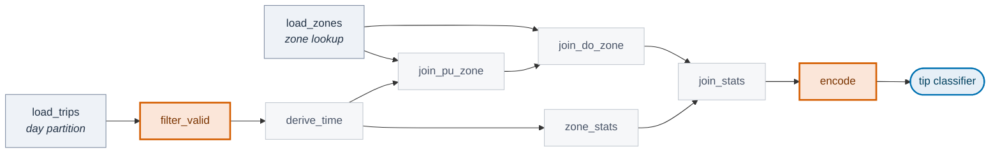
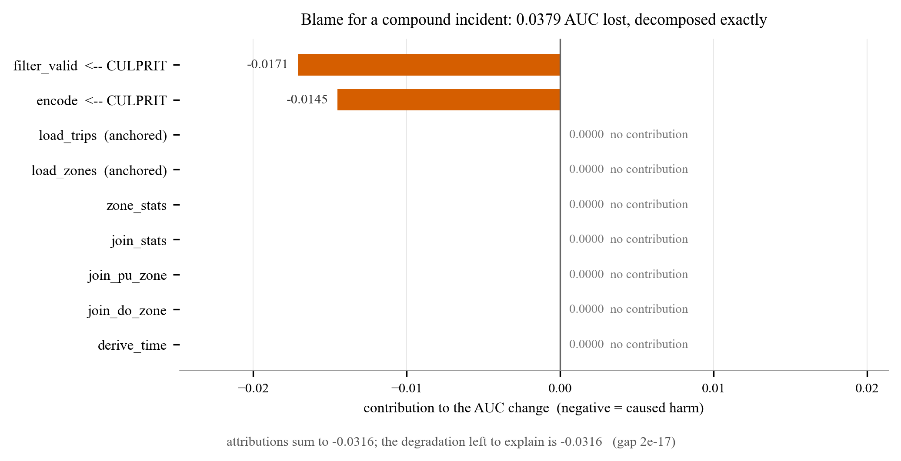
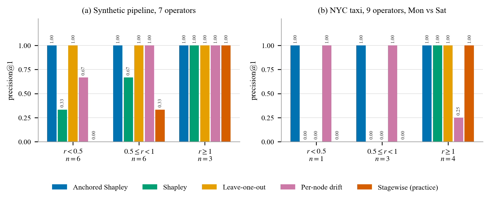

<h1 align="center">CULPA</h1>

<p align="center">
  <b>Counterfactual Utility-Loss Pipeline Attribution</b><br>
  <i>Which task in your ETL pipeline broke the model?</i>
</p>

<p align="center">
  
  
  
  
  
</p>

---

Your Airflow DAG ran fine on Monday. Saturday's model is worse and **nobody
deployed anything**. Today you find the cause by hand — open the lineage graph,
eyeball row counts, form a hypothesis, re-run a branch, repeat. Hours, sometimes
days.

CULPA gives you a number per operator instead. And the numbers **sum exactly** to
the AUC you lost.

## The pipeline

This is the real NYC yellow-taxi pipeline in this repo — nine operators, two
sources, predicting whether a trip gets a generous tip. Two faults were injected
into the Saturday run: a filter predicate silently flipped, and three feature
columns vanished after an upstream rename.



CULPA does not know which two are highlighted. It has to find them.

## What it prints

```
$ python -m experiments.demo

  INCIDENT
  --------------------------------------------------------------
  pipeline          NYC yellow taxi, 9 operators
  reference run     2024-01-08  (Monday)
  incident run      2024-01-13  (Saturday)
  model             generous-tip classifier
  what changed      nothing was deployed

  AUC dropped by    0.0379

  BLAME
  --------------------------------------------------------------
        filter_valid  -0.0171  ############################|      <-- culprit
              encode  -0.0145      ########################|      <-- culprit
         derive_time  +0.0000                              |
        join_do_zone  +0.0000                              |
        join_pu_zone  +0.0000                              |
          join_stats  +0.0000                              |
          zone_stats  +0.0000                              |
          load_zones  +0.0000                              |      (anchored: exogenous)
          load_trips  +0.0000                              |      (anchored: exogenous)

                 sum  -0.0316
          to explain  -0.0316   (v(V) minus the anchored drift)
                 gap 2.08e-17

  COST
  --------------------------------------------------------------
  coalitions in the lattice   512
  model fits actually run     5
  operator cache hit rate     96.8%
  active frontier             3 of 9 operators
```

Both culprits found, ranked correctly, and the blame **adds up to the damage** —
not a score, a decomposition. `filter_valid` cost you 0.0171 of the 0.0316 that
needs explaining; `encode` cost you 0.0145. That split is what tells you whether
fixing one is enough.



## How it works

The pipeline is fixed. What differs between Monday and Saturday is each
operator's **state** — its input partition, its config, or its code. So every
operator can run one of two ways, and for any subset `S` the *hybrid replay*
`Π(S)` runs the whole DAG with `S` in Saturday's state and the rest in Monday's.

That makes the operators players in a cooperative game with
`v(S) = u(S) − u(∅)`, where `u` is model quality on a frozen probe set. Since
`v(V)` is exactly the degradation you observed, the Shapley value **decomposes**
it across operators. Efficiency is not a nice-to-have here — it is the whole
point.

`2^n` replays would be hopeless, so the engine prunes. An operator whose output
hash is unchanged under a state flip is a null player, detectable by *hashing*
with no model fit at all. Operator outputs are memoised on
`(operator, state, hash(inputs))`, so the coalition lattice shares all its
prefixes.

| DAG size | coalitions | model fits | cache hit |
|---:|---:|---:|---:|
| n = 9 | 512 | 5 | 96.8% |
| n = 21 | 2,097,152 | 3 | 99.7% |
| n = 33 | 8,589,934,592 | 3 | 99.8% |

Cost tracks the **active frontier**, not the size of the DAG. That also names its
own failure mode: a change touching many operators at once — a library upgrade,
a backfill — collapses the saving. That case is not yet evaluated.

## The research result

Plain Shapley decomposes exactly but ranks culprits *badly*, because it charges
real blame to the benign day-over-day drift that co-occurs with every incident.
Leave-one-out ranks well on synthetic data but its attributions don't sum to
anything — off by up to 0.246 AUC, more than most incidents.

The **incident-anchored Shapley value** holds the exogenous operators (the
sources — you can't repair the fact that Saturday isn't Monday) at incident
state and takes the Shapley value of the sub-game. It recovers both predecessors
as boundary cases, and beats both.



| method | p@1 synthetic | p@1 real (Mon vs Sat) | decomposes exactly |
|---|---|---|---|
| **anchored Shapley** | **1.00** | **1.00** | **yes — 2.8e-17** |
| leave-one-out | 1.00 | 0.50 | no — 0.246 AUC off |
| per-node drift monitor | 0.87 | 0.62 | no |
| plain Shapley | 0.60 | 0.50 | yes |
| stagewise (what people do today) | 0.33 | 0.50 | no |

Two findings worth pulling out:

**Current practice is provably arbitrary.** Walking the DAG in topological order
and swapping stages one at a time is the marginal-contribution vector of a
*single permutation*. On the same incident, two valid topological orders give
`load_customers = −0.0556` and `+0.0405`. **The sign flips.**

**Not every data-quality violation is an incident.** Uniform join fan-out (35%
duplicate keys) and MCAR nullness (55% of rows dropped) fire every constraint a
monitor has, and cost 0.0001 AUC. CULPA correctly assigns them near-zero blame.

## Quick start

```bash
pip install -r requirements.txt
python -m experiments.demo --fixture     # works immediately, no download
```

For the real NYC taxi data — two public files, no account — see
**[DATA.md](DATA.md)**. Then:

```bash
python -m experiments.demo               # the incident above
python -m experiments.gate               # fault scenarios + benign controls
python -m experiments.severity           # main result, asserts both boundary theorems
python -m experiments.scale              # cost study to n = 33
python -m experiments.real_data --real --days 8,13,10
```

Everything runs in under two minutes on a laptop. No GPU.

## Documents

| | |
|---|---|
| **[PAPER.md](PAPER.md)** | the paper — start here |
| [paper/paper.tex](paper/paper.tex) | same paper in IEEE conference format, ready for Overleaf |
| [DATA.md](DATA.md) | the two files to download, and how to pick day pairs |
| [FINDINGS.md](FINDINGS.md) | the negative result that forced the reformulation |
| [PROPOSAL.md](PROPOSAL.md) | original plan — superseded, kept for the related-work survey |
| `results/` | every run log and CSV behind the numbers above |

## Layout

| file | what |
|---|---|
| `culpa/pipeline.py` | operator/DAG model, hybrid replay engine, memoisation, frontier detection |
| `culpa/game.py` | the cooperative game, exact + Monte-Carlo Shapley, anchored value, baselines |
| `culpa/utility.py` | `u(S)` — train on the replayed table, score on a frozen probe |
| `culpa/workload.py` | the 7-operator synthetic pipeline and its fault injectors |
| `culpa/nyctaxi.py` | NYC TLC loading, schema contract, fixture generator |
| `culpa/taxi_pipeline.py` | the 9-operator taxi pipeline shown above |
| `experiments/` | demo, gate, severity, scale, real_data, make_figures |

Figures are generated from `results/*.csv`, never drawn by hand, so they cannot
drift out of sync with the experiments.

## Honest limitations

Stated up front because reviewers find them anyway, and the full list is in
[PAPER.md](PAPER.md) §8:

- **One real dataset, one pipeline shape.** Whether the crossover sits at the
  same ratio elsewhere is untested.
- **The fault suite is weaker than intended.** 11 of 19 taxi configurations were
  excluded because the injected fault does no damage at all, leaving the
  real-data conclusion resting on 8 test cases.
- **A probe set must exist.** The method needs a fixed evaluation set standing in
  for ground truth. Where labels arrive late, `u` isn't computable as defined.
  This is the most serious practical limitation.
- **The anchor is a modelling choice.** If a source change is itself the
  repairable fault — a misconfigured extraction job rather than real world drift
  — anchoring hides it by construction.

## License

MIT — see [LICENSE](LICENSE).
